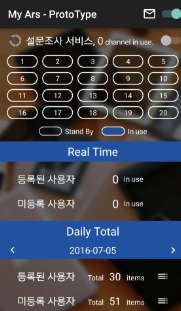
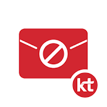

# 김기훈 Portfolio - Mobile App Developer

## 소개
- 이름: 김기훈
- 생년월일 : 1991.01.17
- 경력 : 2013.08 ~ 현재(재직중)
- 취미: ~~보드, 운동~~ (코로나), 자전거, IT Contents Playing(YouTube, Netflix, 밀리의서재, 교보문고 등), ~~라이딩(2019.05-2020.05)~~
- 병력사항: 2010.02 ~ 2011.12 육군 만기전역
- Email: kkh7913@gmail.com, kkh7913@naver.com
- GitHub: [github.com/Silban17](https://github.com/Silban17)
- Notion : ***Update ing...***

## 학력 - 학사
- 인하공전 컴퓨터 시스템과 전문학사(4.22 / 4.5)
- 원격평생숭실교육원 학점은행제 컴퓨터공학 학사

## 회사경력
- [BSS Company] : (2018.03 ~ 현재)
- [Rodaloft] : (2016.10 ~ 2018.03)
- [BlueCore] : (2013.08 ~ 2016.10)

## Android Tech stack & Open-source libraries
- [Kotlin](https://kotlinlang.org/)(★) / [Java](https://www.java.com/)
- RxAndroid, Coroutines
- DI
  - [Koin](https://github.com/InsertKoinIO/koin)(★)
  - [Dagger2](https://dagger.dev/)
- [JetPack](https://developer.android.com/jetpack)
  - LiveData
  - Databinding
  - ViewModel
- Database
  - [Realm](https://realm.io/kr/)(★)
  - Room(+MVVM)
- Design Pattern
  - MVVM (ViewModel - View - Model + DataBinding)(★)
  - MVC (Model - View - Controller)
  - MVP (Model - View - Presenter)
- [AAC(Android Architecture Components)](https://developer.android.com/jetpack/guide?authuser=2)
- [Retrofit2 & OkHttp3](https://github.com/square/retrofit) - REST APIs
- [Glide](https://github.com/bumptech/glide)
- [Timber](https://github.com/JakeWharton/timber)
- [Material-Components](https://github.com/material-components/material-components-android)
- [Spotless](https://github.com/diffplug/spotless)
- WebSocket
 - More...
 
 ## iOS Tech stack & Open-source libraries
- [Swift](https://developer.apple.com/swift/)
- RxSwift, CocoaPods
- [Realm](https://realm.io/kr/)
- MVC (Model - View - Controller)
- [alamofire](https://github.com/Alamofire/Alamofire) - REST APIs
- [ImageLoaderSwift](https://github.com/hirohisa/ImageLoaderSwift)
- [Material-Components](https://github.com/material-components/material-components-android)
- WebSocket
 - More...
 
 ## Process
- Firebase (Fabric / Analytics / RemoteConfig / FCM / Slack)
- Design - Zeplin / Material-Components
- Communication - Telegram / Kakaotalk / Confluence
- Issue tracker - Jira / Trello
- SCM - Git / Bitbucket

### TODO
TDD, Hilt, SwiftUI, Flutter

 ## Project
 **Google Play / AppStore / OneStore 배포**
 | 기간 | 앱 | 인원 | 참여도 | 내용 |
 | :-- |:-:| :-: |  :-:  |:-- |
| 2020.06 - 진행중 | <a href="https://play.google.com/store/apps/details?id=com.bss.sports" target="_blank"></a><br>**네임드스코어**<br>Android | 1 -> 2 | 90% | 전세계 종목별, 경기별 실시간 상황 중계<br>**PART**<br>  - 설계 및 리드개발<br> **Content**<br>- 스포츠 종목 별 실시간 상황 리스트 제공(N스포츠 Renewal)<br>- 종목별 상세 데이터 제공&nbsp;&nbsp;- 개인 별 맞춤 알림<br>- 실시간 채팅&nbsp;&nbsp;- 스크린샷 및 공유<br>**STACK**<br>- `Kotlin`, `MVVM`, `ACC`, `DI`,`Room`,`OkHttp`,<br>`Retrofit2`,`Firebase`,`WebSocket`,`Glide`,`spotless` |
| 2019.06 - 2019.12 | <br>**Bitmeet**<br>Android | 1 | 100% | 글로벌 100여개 거래소 정보 및 암호화폐 정보 실시간 제공<br>**PART**<br>  - 100% 개발<br> **Content**<br>- MobileWebView + FCM + JavaScript<br>- 소셜로그인&nbsp;&nbsp;- 개인 별 맞춤 알림<br>- ~~현재 서비스 중단~~<br>**STACK**<br>- `Kotlin`, `MVC`, `Firebase`,`Javascript`,`CSS` |
| 2016.12 - 2020.12 | <a href="https://onesto.re/0000712067" target="_blank"></a><br>**N스포츠**<br>Android / iOS | 6 -> 4 -><br> 2 -> 1 | 75% | - 전세계 종목별, 경기별 실시간 상황 중계 <br> **PART**<br>- 구조설계 및 신규 기능개발, <b>유지보수</b> Android / iOS<br> **Content**<br>- 스포츠 종목 별 실시간 상황 리스트 제공<br>- 종목별 상세 데이터 제공<br>- 개인 별 맞춤 알림<br>- 실시간 채팅<br>**STACK**<br> - `Kotlin`,`JAVA`,`Swift4`,`MVC`,`Realm`,<br>`OkHttp`,`Retrofit2`,`Firebase`,`WebSocket`,`Glide`,`EventBus` |
| 2016.01 - 2016.06 |<br>**MyARS**<br>Android | 1 | 100% | - Kt 114 자동 응답 문자 서비스<br> **PART**<br>- 전체 개발 + Design<br> **Content**<br>- Socket 통신 및 자체 문자 발송<br>- 디자이너 없이 자체 개발<br>- 100개 동시 처리<br>- SQLite 저장 내역<br>**STACK**<br> - `Socket`,`MMS+SMS` |
| 2015.03 - 2016.10 | <a href="https://play.google.com/store/apps/details?id=com.bluecore.app.itpouch" target="_blank"></a><br>**it pouch**<br>Android | 2 | 60% | - 한국 / 중국 대상 Beauty Content 제공<br> **PART**<br>- 기능개발 및 유지보수<br> **Content**<br>- Swipe+GridLayout Main Page<br>- 빠른 이미지 로딩(.Webp, Gif)<br>- GCM Event Push<br>- QR Code, NFC, Beacon 인식 및 공유<br>**STACK**<br> - `JAVA`,`MVC`,`SVN`,`Picasso`,`Butterknife`,`NFC`,`Beacon` |
| 2013.08 - 2016.10 | <a href="https://play.google.com/store/apps/details?id=com.olleh.spam" target="_blank"></a><br>**KT스팸차단**<br>Android | 1 | 100% | - KT 부가서비스로 사용자가 원하는 메시지 차단<br> **PART**<br>- 전체개발 및 유지보수<br> **Content**<br>- 내부 DB 접근하여 SMS/MMS 추출<br>- Android M 대응<br>- KT 내부 라이브러리 연동**STACK**<br> - `JAVA`,`Eclipse`,`Xml 통신`,`SVN`,`NDK`,`SQLite`,`9-patch` |

***기타 사이드 프로젝트 진행***<br>
 - 쇼핑몰 앱 : Native 쇼핑몰 앱 제작 <br>
 - 이명치료 앱 : Engine에서 특정 주파수 제거 후 음악 재생 플레이어<br>
 - 로또 당첨 확인 앱 : 로또당첨시간, 당첨 알림, QR 코드 인식
 - 이미지 앨범 : 카카오 API 연동하여 이미지 검색 후 갤러리 저장 등..
 
 ```
Why? 왜 하는지 꼭 알고 개발하자
```
